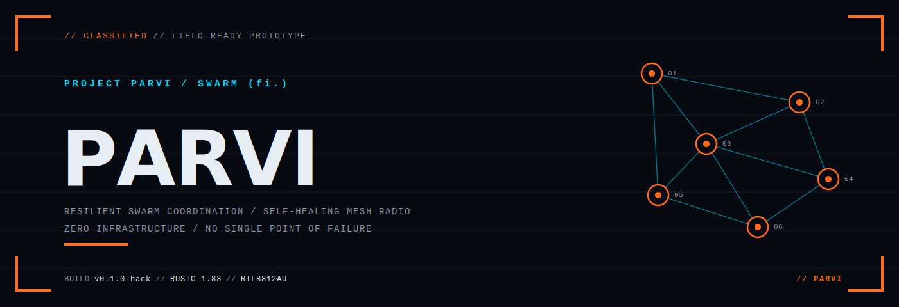

<p align="center">
  
</p>

# Parvi Protocol

A tactical mesh network for drone swarm coordination, built for the Kova Labs Tactical Mesh Challenge. Nodes share target detections, commands, battle damage assessments, real-time imagery, and chat over a self-healing 802.11 radio mesh: no infrastructure, no internet, no single point of failure.

Operates on RTL8812AU USB radio adapters in monitor mode with raw packet injection. Every frame is Ed25519-signed and XChaCha20-encrypted. The network routes itself via OLSR and survives jamming via automatic channel hopping.

---

## Hardware Requirements

- RTL8812AU USB WiFi adapter per node (monitor mode + packet injection)
- Linux with `iw`, `ip`, pcap headers

---

## Build

```bash
cargo build --release
sudo bash scripts/setcap.sh   # grant raw socket caps; re-run after every build
```

`setcap.sh` applies `cap_net_raw,cap_net_admin=eip` to the binary so it can open raw packet sockets without running as root.

---

## Radio Setup

Set the adapter to monitor mode before running (do this once per boot):

```bash
sudo pkill wpa_supplicant; sudo nmcli device set wlan1 managed no
sudo ip link set wlan1 down
sudo iw dev wlan1 set type monitor
sudo ip link set wlan1 up
sudo iw dev wlan1 set channel 6
```

---

## Run

```bash
# Three-node demo (all share the built-in demo PSK)
./target/release/tacticalmesh-bin --node-id 1 --iface wlan1
./target/release/tacticalmesh-bin --node-id 2 --iface wlan1
./target/release/tacticalmesh-bin --node-id 3 --iface wlan1

# With a real PSK file (32 bytes, shared across all nodes)
./target/release/tacticalmesh-bin --node-id 1 --iface wlan1 --psk-file ./psk.bin

# Override the image this node serves when another node requests it
./target/release/tacticalmesh-bin --node-id 1 --iface wlan1 --image-file ./photo.jpg
```

The default image (served when `--image-file` is omitted) is `assets/tank.jpg` scaled to 320×240, or a built-in test pattern if the file is missing.

---

## TUI Key Bindings

| Key | Action |
|-----|--------|
| `t` | Broadcast target detection at random coords |
| `f` | Send BDA (Destroyed) for selected target |
| `c` | Type a chat message (Enter to send, Esc to cancel) |
| `m` | Send MAYDAY from this node |
| `i` | Request image for selected target over the mesh |
| `p` | Preview this node's local image (no network) |
| `j` | Toggle jam simulation |
| `b` | Toggle comms blackout simulation |
| `↑ / ↓` | Select target in list |
| `q` | Quit |

---

## Architecture

```
tacticalmesh-bin      ← executable: TUI, task wiring, CLI
├── tacticalmesh-link ← radio layer: pcap RX, PF_PACKET TX, priority queues
├── tacticalmesh-wire ← frame format: Ed25519, XChaCha20, nonce cache
├── tacticalmesh-olsr ← routing: HELLO/TC floods, Dijkstra, MPR selection
└── tacticalmesh-app  ← app state: CRDT target board, image cache, messages
```

### Wire Frame Format

```
[RoutedHeader  4 B]  dst_node, src_node, hops_taken, reserved
[AuthHeader   44 B]  msg_kind, priority, src_node, dst_node, timestamp_ms, nonce
[Ed25519 Sig  64 B]  signs RoutedHeader || AuthHeader || ciphertext
[XChaCha20 ciphertext]  encrypts payload with PSK-derived session key
```

Stream IDs (`BLAKE3(session_key || epoch || priority_label)` → u32) are encoded in 802.11 MAC addresses and rotate every 5 minutes, breaking traffic analysis and passive fingerprinting.

---

## Security Properties

| Threat | Mitigation |
|--------|-----------|
| Frame injection | Ed25519 signature on every frame |
| Replay | Nonce cache + 30 s clock window |
| Traffic analysis | BLAKE3 stream IDs rotate every 5 min |
| Eavesdropping | XChaCha20-Poly1305 with per-frame nonces |
| Jamming | HELLO-absence detector triggers automatic channel hop |

Authentication is stateless, with no handshake, so reboots and blackouts never break the security model.

---

## Priority Queues

| Priority | Label | Used for |
|----------|-------|---------|
| 0 | Emergency | Jam alerts, channel hops, MAYDAY |
| 1 | Critical | Commands, BDA |
| 2 | High | OLSR HELLO / TC, target detections |
| 3 | Bulk | Image shards, state reports, chat |

Emergency frames are always dequeued before Bulk, regardless of arrival order.

---

## Image Transfer

Pressing `i` sends a `RequestImage` to the mesh. Any node that has an image responds by JPEG-encoding it (quality 75, max 320×240) and streaming it as 1207-byte shards over the Bulk channel. Shards are paced (4 per 10 ms burst) to prevent RX queue overflow. The receiver reassembles and displays the image inline in the TUI.
